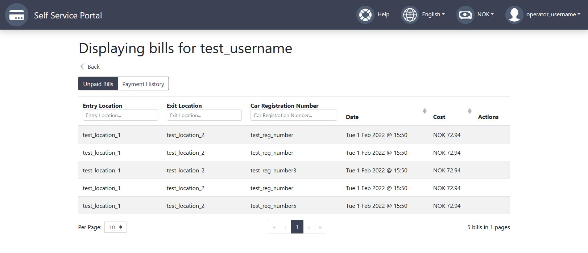

# View Driver's Bills as Toll Operator

On the View Users screen, the Toll Operator can select to view all the bills a Driver has accumulated. The button to display this is located in the Actions column.

Once the action button is clicked a list of bills for that Driver is displayed. It shows the unpaid bills and the payment history for that Driver.

#
