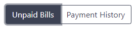
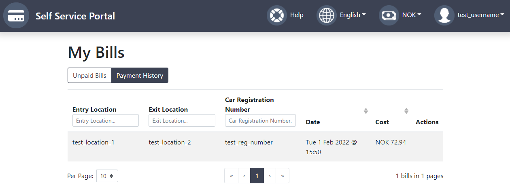
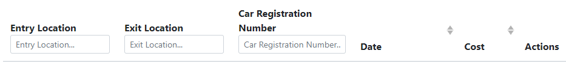

# Viewing my bills

When logged in as a user, this is the route page of the system. Using this page, the user can see all of their outstanding bills. When the user clicks the toggle, they can switch the table view to see all of their payment history.

## Filtering

The user is able to filter the table via each column using the filters provided below the title of each column. This will match any row based on the information provided.

## Pay a bill

The user is able to navigate to the 'Pay Bill' screen by locating the bill in the unpaid bills view and clicking on the 'Pay bill' button which is located in the 'actions' column. The user will then be navigated to the pay bill screen where they can see details about the bill and pay either via paypal or card.